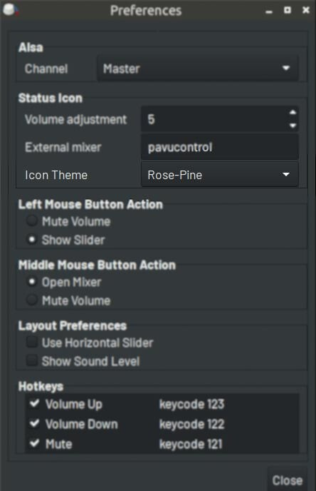

# Rose Pine Theme for Volume Icon 0.4.6

[Git repo](https://github.com/jdulloa/Rose-Pine-Theme-for-Volume-Icon)

Icons by [Uicons](https://www.flaticon.com/uicons)

## How to install:

* Move the `Rose-Pine` folder to the `Volume Icon` themes folder:

`sudo mv Rose-Pine /usr/share/volumeicon/icons`

* Open `Volume Icon` Preferences:

* Select `Rose-Pine` from the `Icon Theme` dropdown list:

