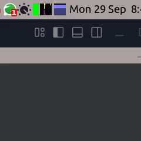

# Rose Pine Theme for Volume Icon 0.4.6

## Details

A custom Rose Pine theme for Volume Icon 0.4.6 with three variants.

[Git repo](https://github.com/jdulloa/Rose-Pine-Theme-for-Volume-Icon)

Icons by [Uicons](https://www.flaticon.com/uicons)

## Preview

## How to install:

1. Move the folders to the `Volume Icon` themes folder:

`sudo mv Dark-Rose-Pine Light-Rose-Pine Rose-Pine /usr/share/volumeicon/icons`

2. Open `Volume Icon` Preferences:

3. Select the `Rose-Pine` theme variant of your choice from the `Icon Theme` dropdown list:

